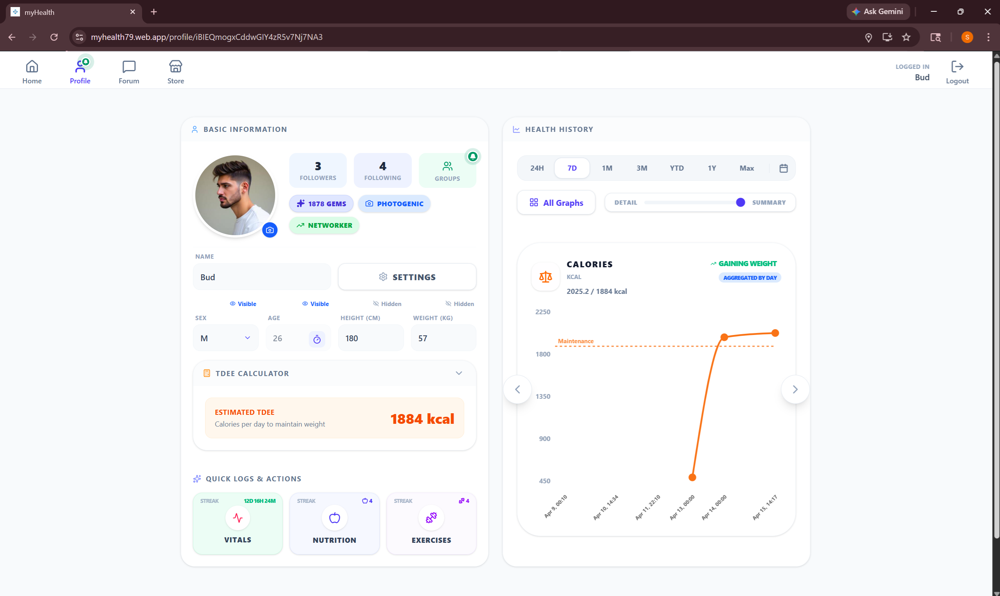

# MyHealth

Social platform for tracking personal health.

Capabilities include: 
* alerts when a user's vital signs are out of the normal range
* display that informs the user when they are gaining or losing weight, and when they are improving or diminishing in exercises
* cohort comparison of the user's vital sign, nutrition, and exercise values to a random sample; shows where the user stands in comparison to others
* correlation and intervention tests using personal and global datasets to prove that some statistics are correlated, allowing the user to make better health choices
* group chat and planning (ideal for teams and healthcare)
* interacting with AI trained in health and wellness
* forum to discuss anything ranging from personal health topics to public health concerns

## Getting Started

https://myhealth79.web.app/